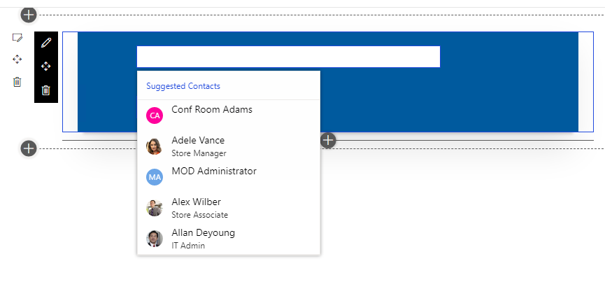
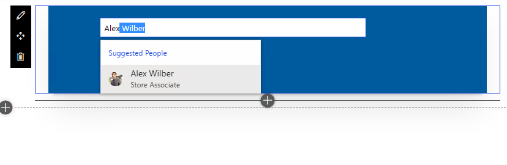
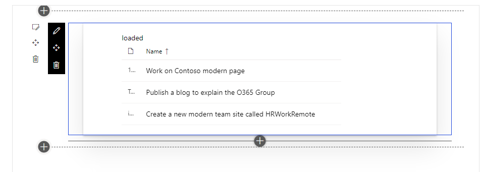

## SPODemo

This is where you include your WebPart documentation.

## components
* 

## Solutions
| Folder                        | Type     | Description                                                                                                                                                                                                                                                                                                                                                      |
| ----------------------------- | :------- | :--------------------------------------------------------------------------------------------------------------------------------------------------------------------------------------------------------------------------------------------------------------------------------------------------------------------------------------------------------------- |
| src/webparts/peoplePickerDemo | Web Part | Microsoft Edge debugger  Fabric UI People Picker demo  In order work for Graph API, please make the following configuration <ul><li>Grant User.Read.All permssion in order to get full user's properties</li></ul>   |
| src/webparts/singlePartDemo   | Web Part | SPFx Single Part demo showcased a tasks' list from a login user's planner                                                                                                                                                                                                                        |

