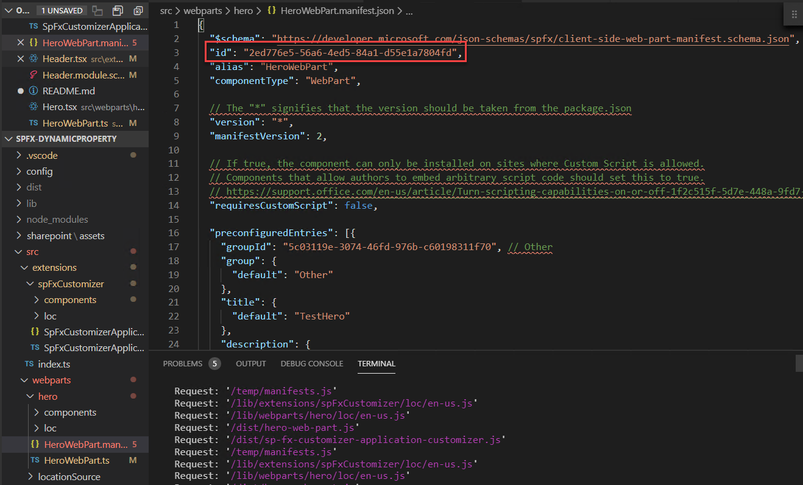
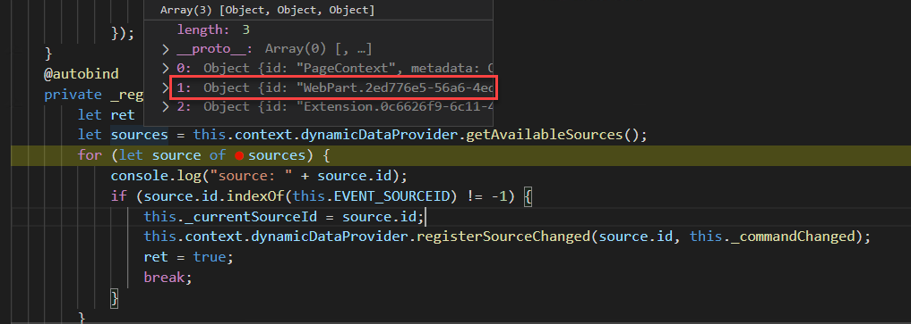

## sp-fx-dynamic-property

This is a webpart to demonstrate the communication between extension and web part. 

### Explanation
The IDynamicDataSource array returned WebPartContext.dynamicDataProvider.getAvailableSources() includes all dynamic data property object. Each IDynamicDataSource has a Id to indicate each source. the Id format is "Webpart.[WebpartId].[SeqNum]" which allows you to get the source based on a Wep Part Id since the Web Part Id is predefined in manifest file. The below flow will show you how to programmatically bind to a dynamic property source: 
* record your web part id from web part's manifest file. 
  
* use `WebPartContext.dynamicDataProvider.getAvailableSources()` to enumerate all available source and find out source based on the web part id found from above step.
* use `WebPartContext.dynamicDataProvider.registerSourceChanged(source.id, this._commandChanged)` to register a callback for dynamic property source change event. 
  
* since the web part can be added later when a end user manually add that, you also need to register `WebPartContext.dynamicDataProvider.registerAvailableSourcesChanged` event to go the above process whenever a available sourc is changed. 

### Building the code

```bash
git clone the repo
npm i
npm i -g gulp
gulp
```

This package produces the following:

* lib/* - intermediate-stage commonjs build artifacts
* dist/* - the bundled script, along with other resources
* deploy/* - all resources which should be uploaded to a CDN.

### Run step

* Update server.json to include your test SPO page URL. 
* type ```gulp server``` to compile the code. 
* a extension header will be added into your testing modern page. Add your web part to page. When you change location from header, the web part content will be changed. 
